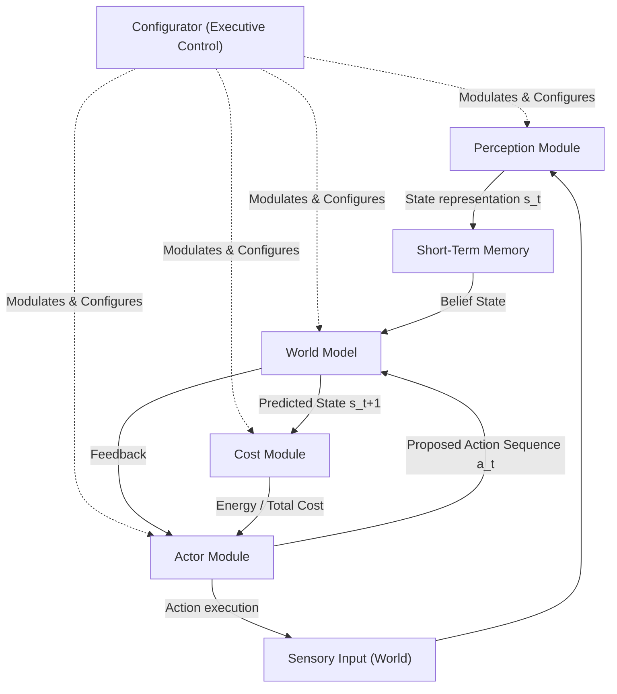
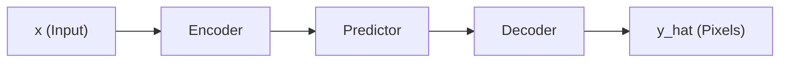

This document summarizes the core concepts of Yann LeCun's position paper **"A Path Towards Autonomous Machine Intelligence"** (Version 0.9.2, 2022) and maps out the critical uncertainties, limitations, and open problems that must be solved to advance the field of world models.

---

## 1. Key Architectural Concepts (LeCun's Proposal)

LeCun proposes an autonomous agent architecture driven by **energy minimization** and **intrinsic motivation**, moving away from pure model-free reinforcement learning (RL) and generative Large Language Models (LLMs). The architecture consists of six main modules:



### The Six Modules
1. **Perception**: Encodes raw sensory inputs into abstract state representations ($s_t$), discarding task-irrelevant background noise.
2. **World Model**: The predictive engine. Given the current state representation $s_t$, a proposed action $a_t$, and a latent variable $z_t$ (representing unknown environmental factors), it predicts the subsequent state representation $s_{t+1}$.
3. **Actor**: Proposes action sequences. In **Mode-2 (Reasoning & Planning)**, the Actor uses the World Model to simulate future trajectories, optimizing actions to minimize the output of the Cost module. In **Mode-1 (Reactive)**, it uses a fast, compiled policy network.
4. **Cost**: Evaluates agent behavior using two sub-modules:
   * *Intrinsic Cost*: Hand-designed, immutable safety guardrails and drives (e.g., avoiding pain, seeking novelty).
   * *Trainable Critic*: A neural network that learns to predict future intrinsic costs, acting as a value function.
5. **Configurator**: The central controller. It receives inputs from all modules and dynamically modulates parameters, routes signals, sets subgoals, and configures the attention graphs of other modules (e.g., using Transformer tokens).
6. **Short-Term Memory**: Stores and retrieves past states of the world to maintain a coherent belief state over time.

### JEPA (Joint Embedding Predictive Architecture)
Unlike generative models (e.g., Denoising Autoencoders or video predictors that predict raw pixels), a **JEPA** predicts *in representation space*. 

  ### Generative Predictor



  ### JEPA Predictor (Joint Embedding Predictive Architecture)
  ```mermaid
  graph LR
        X["x (Input)"] --> EncX["Encoder_x"]
        EncX --> SX["s_x (Representation of x)"]
        SX --> Pred["Predictor"]
        Pred --> SYH["s_y_hat (Predicted Representation of y)"]

        Y["y (Target)"] --> EncY["Encoder_y"]
        EncY --> SY["s_y (Actual Representation of y)"]

        SYH --> Comp{"Compare (L2/Energy)"}
        SY --> Comp
  ```


By predicting the abstract representation $s_y$ rather than raw pixels $y$, the system ignores unpredictable high-frequency details (e.g., leaves rustling in the wind) and focuses purely on predictable structure.

### Non-Contrastive Training & VICReg
Contrastive methods (which push representations of different images apart) suffer from the *curse of dimensionality* when scaling to high-dimensional state spaces. JEPA uses **non-contrastive training** (like **VICReg** - Variance, Invariance, Covariance Regularization) to prevent representation collapse:
* **Variance**: Prevents collapse by forcing the standard deviation of each feature component across a batch to remain above a threshold.
* **Invariance**: Minimizes prediction error in representation space.
* **Covariance**: Pushes the covariance between different feature components to zero, decorrelating features and maximizing information capacity.

---

## 2. Mapping the Open Problems & Limitations in World Models

While LeCun's position paper outlines a elegant, unified framework, instantiating it reveals deep-seated theoretical, computational, and architectural challenges. The table below categories these problems:

### Category A: Representation Learning & Collapse

#### 1. Optimal Regularization of the Latent Variable $z$
* **The Problem**: To prevent a JEPA from experiencing "informational collapse" (where the predictor ignores the state $s_x$ and simply uses a high-capacity latent $z$ to copy $s_y$), the information capacity of $z$ must be strictly minimized.
* **Uncertainties**: What is the best mathematical way to regularize $z$? Current proposals include discreteness (quantization), low-dimensionality, sparsity, or stochastic noise (like VAEs). However, restricting $z$ too much destroys the model's ability to represent multi-modal, complex branching futures (e.g., a pedestrian choosing to go left or right).
* **Granularity**: Medium

#### 2. Abstract Feature Drifting in Hierarchical JEPAs (H-JEPA)
* **The Problem**: Stacking JEPAs hierarchically (where higher layers take lower-layer representations as input to predict over longer time scales) risks "semantic drift."
* **Uncertainties**: How do we prevent higher-level encoders from collapsing into trivial constant representations, or simply copying lower-level features without actually learning higher levels of spatial and temporal abstraction?
* **Granularity**: Big

#### 3. Inductive Bias Alignment with Control (Downstream Tasks)
* **The Problem**: VICReg and Barlow Twins maximize the information content of $s_x$ and $s_y$ purely through statistical statistics (variance/covariance). 
* **Uncertainties**: A representation can contain high-capacity information that is completely useless for control, or it might discard highly critical but low-entropy cues (e.g., a tiny warning light on a dashboard). We do not yet know how to structurally bias SSL encoders to select features *useful for downstream planning and control* without reverting to task-specific supervised rewards.
* **Granularity**: Big

---

### Category B: Planning & Action Optimization (The Actor's Dilemma)

#### 4. Continuous Relaxation of Discrete Decision Landscapes
* **The Problem**: Gradient-based planning (backpropagating gradients from the cost module through the unfolded world model to optimize actions) requires the entire path to be differentiable.
* **Uncertainties**: High-level planning is naturally discrete (e.g., "turn left at the fork" or "pick up object A vs. B"). Gradient descent fails on discrete action spaces. While we can use gradient-free searches (MCTS, CEM, or SAT solvers), they scale poorly. The open problem is finding a way to train representations such that discrete planning problems can be relaxed into smooth, continuous manifolds where gradients can flow effectively.
* **Granularity**: Big

#### 5. Chaotic Energy Landscapes and Vanishing/Exploding Gradients
* **The Problem**: Even if all modules are technically differentiable, the function mapping actions to final costs over a long time horizon is highly non-smooth, filled with local minima, saddle points, and chaotic discontinuities (e.g., contact dynamics in physics engines).
* **Uncertainties**: Standard backpropagation through time (BPTT) through an unfolded world model suffers from severe vanishing or exploding gradients. We lack robust techniques to smooth these optimization landscapes for long-term planning without introducing bias.
* **Granularity**: Medium

#### 6. Amortized Inference (Transitioning Mode-2 Planning to Mode-1 Habits)
* **The Problem**: Running optimization algorithms (like gradient descent or MCTS) in a world model at runtime is too computationally expensive for real-time reactive control (Mode-2 reasoning).
* **Uncertainties**: How do we systematically "distill" or "amortize" the slow planning trajectories generated by the world model into a fast, reactive policy network (Mode-1) online? If the environment is dynamic and non-stationary, how does the agent balance executing reactive habits vs. pausing to replan?
* **Granularity**: Medium

---

### Category C: Hierarchical Abstraction & Executive Control

#### 7. The Configurator's "Black Box" (Subgoal Generation)
* **The Problem**: The Configurator is the most mysterious and least defined module in LeCun's architecture. It is tasked with taking a high-level goal and decomposing it into a sequence of subgoals (which are then used to modulate the Cost and Predictor modules).
* **Uncertainties**: We have no clear, differentiable framework for how a neural network can autonomously learn to decompose a goal (e.g., "build a house") into spatial and temporal subgoals (e.g., "lay foundation", "raise walls", "install roof") without human-designed schemas. How does the Configurator learn to modulate attention masks and routing pathways dynamically?
* **Granularity**: Big

#### 8. Spatial-Temporal Alignment Across Hierarchies
* **The Problem**: Higher levels of an H-JEPA must predict at a coarser temporal resolution (e.g., predicting arrival time at a destination) while lower levels predict at a fine resolution (e.g., predicting the car's steering angle at 100Hz).
* **Uncertainties**: How do we enforce mathematical consistency between the high-level plan and the low-level actions? If a high-level plan predicts an abstract trajectory, how does that translate into a sequence of lower-level subgoals without losing alignment when local unexpected events occur (e.g., a pothole)?
* **Granularity**: Big

---

### Category D: Uncertainty, Memory, and Belief Tracking

#### 9. Epistemic vs. Aleatoric Uncertainty in Representation Predictions
* **The Problem**: A world model must distinguish between what it does not know because it hasn't observed it yet (epistemic uncertainty, which drives exploration/curiosity) and what is fundamentally stochastic/random in the environment (aleatoric uncertainty, which should be ignored).
* **Uncertainties**: In representation space, it is extremely difficult to isolate these two forms of uncertainty. If the predictor error is high, is it because the model needs more training (epistemic) or because the feature is inherently unpredictable (aleatoric)? Misidentifying this leads to the "noisy TV problem" where the agent gets trapped staring at unpredictable noise.
* **Granularity**: Medium

#### 10. Associative Working Memory for Partial Observability
* **The Problem**: Realistic environments are Partially Observable Markov Decision Processes (POMDPs). The agent must maintain a belief state of the world using Short-Term Memory.
* **Uncertainties**: How should this memory be structured? Standard recurrent states (like GRUs/LSTMs) compress history into a fixed-size vector, which discards long-term details. Explicit associative memories (like Neural Turing Machines or Memory Networks) are hard to train stably, scale poorly, and struggle with gradient-based retrieval under noisy representation spaces.
* **Granularity**: Medium

---

### Category E: Empirical and Training Challenges

#### 11. Sample Efficiency of World Model Training from Video
* **The Problem**: Humans learn world models passively by watching the world move around them. Doing this with neural networks requires massive amounts of video data and compute.
* **Uncertainties**: Can a deep network learn a robust 3D intuitive physics model purely from 2D pixel streams without explicit 3D inductive biases (like camera projections or NeRF-style representations)? Current JEPAs require millions of frames to learn simple concepts, whereas infant animals learn them in hours.
* **Granularity**: Medium

#### 12. Intrinsic Cost Function Design and Safety Guardrails
* **The Problem**: The agent's ultimate behavior is driven by minimizing the Intrinsic Cost module.
* **Uncertainties**: Designing a static, differentiable mathematical function that represents "safety" and "basic drives" is highly challenging. If the function has any mathematical loophole, the Actor will exploit it during optimization, leading to unsafe or bizarre behaviors (reward hacking).
* **Granularity**: Small

---

## 3. Summary of Core Research Frontiers

To make autonomous machine intelligence a reality, researchers must focus on three core frontiers:
1. **Self-Supervised Learning that Align with Control**: Moving beyond VICReg to objective functions that measure a representation's utility for planning and control rather than just statistical information content.
2. **Differentiable Discrete Planning**: Devising architectures that allow discrete, symbolic, and combinatorial search spaces to be optimized using gradient descent.
3. **Autonomous Subgoal Formulation**: Developing the theory behind the Configurator module, defining how hierarchical neural networks can segment tasks temporally and spatially without manual labels.
